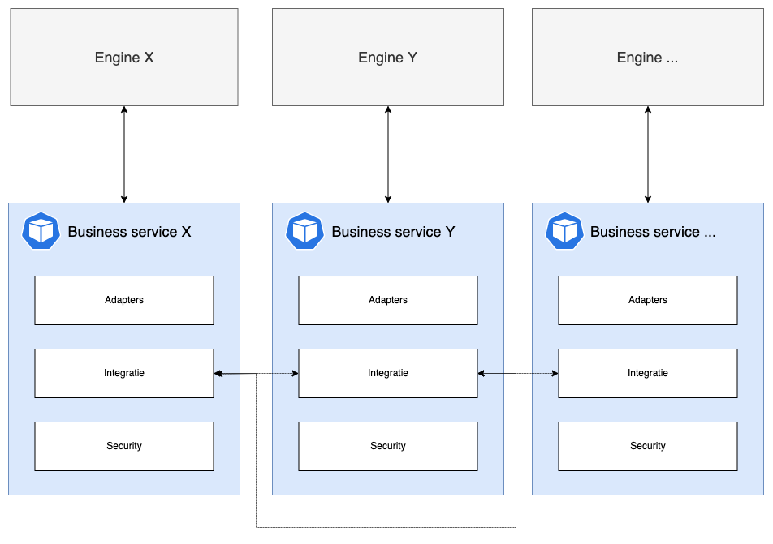

# Architectuur

De GPuBP Content management bestaat uit 2 systemen.\
Een backend (WCM) die een aantal API's voorziet en een interface (Redactie) op deze API's.

> De termen "WCM" en "Redactie" worden doorgaans door elkaar gebruikt maar binnen deze documentatie hebben ze steeds een verschillende betekenis:
> - Web Content Management (WCM): Alle backend (micro)services
> - Redactie: Interface op de WCM

<!-- Indien je beide systemen op een 
 -->

## Web Content Management (WCM)

De WCM draait in een microservice architectuur waarbinnen we 4 lagen onderscheiden:
- Engines
- Business services
- Admin
- Gateway

Sommige lagen bestaan uit één service andere uit meerdere (micro)services.\
Elke laag heeft echter wel een specifiek doel waarbij de services die onder zo'n laag vallen niet buiten deze doeleinden mogen treden.

Deze lagen staan als volgt t.o.v. elkaar:

### Engines

Een engine is een service dat op zijn eigen kan bestaan en niet hoort af te weten van de WCM context.\
Deze type service beheert vaak een specifiek entiteit of functionaliteit en spreekt enkel ander engines aan als dit nodig is voor zijn eigen context.\
Hij spreekt **nooit** een andere engine aan als dit nodig is voor de WCM context maar niet nodig is voor zijn eigen context.

Een engine is dus in theorie vervangbaar binnen de WCM context en herbruikbaar buiten deze context.

De WCM maakt gebruik van zowel "interne" engines als "externe" engines waarbij interne engines specifiek gebouwd zijn voor de WCM en externe engines reeds aanwezig waren en door de WCM context (her)gebruikt worden.

### Business services

Business services werken volledig binnen de WCM context en hebben meestal (maar niet altijd) een connectie met 1 of meerdere engines.\
Elke service werkt in functie van een specifiek entiteit of functionaliteit.\

Deze services staan o.a. in voor de volgende taken:
- Engine data beschikbaar stellen
- Integratie met andere business services
- Beveiliging van data binnen WCM Rollen & rechten context

### Gateway

De gateway is de toegangspoort (slimme proxy) waarmee de redactie interface en afnemers kunnen spreken.\
Daarnaast biedt deze service ook een volledige swagger documentatie per tenant en security level.

De proxy voorziet de volgende twee zaken:
- Gaat op basis van de route, contract, tenant en credentials na of deze route wel toegankelijk is
- Vervangt een apikey (of application identifier) door een tenant context in de vorm van een JWT token

### Admin

De admin service voorziet de nodige data aan de business services en gateway zodat zijn de juiste WCM context verkrijgen om hun taken uit te voeren.
Deze service biedt naast een API ook een eigen minimale interface aan om de WCM context te beheren.

De WCM context bestaat uit:
- **Tenants**: info over alle instanties van het WCM met hun credential en module configuratie
- **Modules**: informatie van alle business services & frontend modules (zie verder)
- **Credentials**: keys gekoppeld aan tenants, modules of afnemers met elk hun eigen instelbare privileges

## Redactie

Coming soon!

<!-- ### Redactie app

### Modules

### Module installer

## Modulaire strategie -->