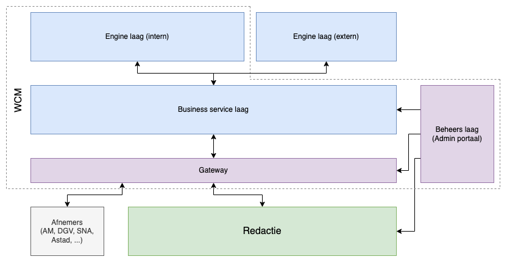

# Architectuur

De GPubP Content beheer bestaat uit 2 systemen.\
Een backend (WCM) die een aantal API's voorziet en een interface (Redactie) op deze API's.

> [!note] De termen "WCM" en "Redactie" worden doorgaans door elkaar gebruikt maar binnen deze documentatie hebben ze steeds een verschillende betekenis:
> - Web Content Management (WCM): Alle backend (micro)services
> - Redactie: Interface op de WCM

## Web Content Management (WCM)

De WCM draait in een microservice architectuur waarbinnen we 4 lagen onderscheiden:
- Engines
- Business services
- Admin
- Gateway

Sommige lagen bestaan uit één service, andere uit meerdere (micro)services.\
Elke laag heeft echter wel een specifiek doel waarbij de services die onder zo'n laag vallen niet buiten deze doeleinden mogen treden.

Deze lagen staan als volgt t.o.v. elkaar:

### Engines

Een engine is een service dat op zichzelf kan bestaan en niet hoort af te weten van de WCM context.\
Deze type service beheert vaak een specifieke entiteit of functionaliteit en spreekt enkel andere engines aan als dit nodig is voor zijn eigen context.\
Hij spreekt **nooit** een andere engine aan als dit nodig is voor de WCM context maar niet nodig is voor zijn eigen context.

Een engine is dus in theorie vervangbaar binnen de WCM context en herbruikbaar buiten deze context.

De WCM maakt gebruik van zowel "interne" engines als "externe" engines waarbij interne engines specifiek gebouwd zijn voor de WCM en externe engines reeds aanwezig waren en door de WCM context (her)gebruikt worden.

### Business services

Business services werken volledig binnen de WCM context en hebben meestal (maar niet altijd) een connectie met 1 of meerdere engines.\
Elke service werkt in functie van een specifieke entiteit of functionaliteit.

Deze services staan o.a. in voor de volgende taken:
- Engine data beschikbaar stellen
- Integratie met andere business services
- Beveiliging van data binnen WCM Rollen & rechten context

### Gateway

De gateway is de toegangspoort (slimme proxy) waarmee de redactie interface en afnemers kunnen spreken.\
Daarnaast biedt deze service ook een volledige swagger documentatie per tenant en per security level.

De proxy voorziet de volgende twee zaken:
- Gaat op basis van de route, contract, tenant en credentials na of deze route wel toegankelijk is
- Vervangt een apikey (of application identifier) door een tenant context in de vorm van een JWT token

### Admin

De admin service voorziet de nodige data aan de business services en gateway zodat zij de juiste WCM context verkrijgen om hun taken uit te voeren.
Deze service biedt naast een API ook een eigen minimale interface aan om de WCM context te beheren.

De WCM context bestaat uit:
- **Tenants**: info over alle instanties van het WCM met hun credential en module configuratie
- **Modules**: informatie van alle business services & frontend modules (zie verder)
- **Credentials**: keys gekoppeld aan tenants, modules of afnemers met elk hun eigen instelbare privileges

## Redactie

De Redactie is een modulaire interface op de WCM API.\
Deze applicatie biedt de nodige tools om:
- te authenticeren
- multitenancy te ondersteunen
- modules in te laden
- routing & navigatie af te handelen
- communicatie tussen modules mogelijk te maken.

Om dit te realiseren is deze applicatie opgedeeld in de volgende onderdelen:
- BFF
- twee React apps (tenant overview & tenant)
- module installer service
- modules

Schematisch staan deze onderdelen als volgt t.o.v. elkaar:

### Redactie app
De redactie applicatie bestaat uit 3 onderdelen: de BFF, tenant overview React app en tenant React app.

De BFF biedt de 2 frontend applicaties aan en voorziet een proxy interface naar de WCM.
Daarnaast staat deze service ook in van het aanbieden en afschremen van de modules op basis van user & tenant gegevens.

De 2 frontends worden aangeboden op basis van routing waarbij:
- redactie.antwerpen.be naar de tenants overview applicatie verwijst
- redactie.antwerpen.be/client/:id/... naar de tenant applicatie verwijst

De Tenants overview applicatie is een vrij simpele react app dat tenants, specifiek voor een user, beschikbaar stelt en de mogelijkheid biedt om naar een specifieke tenant te navigeren.

De tenant applicatie is de core van de interface en staat in voor het inladen en beschikbaar stellen van de modules.\
Deze applicatie biedt aan de modules de nodige tools om hun pagina's en functionaliteit beschikbaar te stellen aan de ingelogde user.

### Modules

Redactie modules zijn npm packages die op een specifieke manier worden ingeladen zodat deze gemakkelijk kunnen integreren met de core en elkaar.\
Deze npm packages worden gepackaged door webpack met een specifieke Redactie Webpack plugin zodat deze bij het inladen context kunnen verkrijgen van de Core.

De core biedt via de Core package (zie hierboven) 4 functionaliteiten aan:
- Registreren van routes
- Registreren van menu items aan de hoofdnavigatie
- Beschikbaar stellen van logica aan andere modules
- Logica opvragen van andere modules

### Module installer

De module installer is een service dat alle beschikbare Redactie modules ophaalt van de WCM Admin API en en één voor één installeert op een AWS bucket.
Deze AWS bucket wordt dan door de Redactie app aangesproken om de modules aan te bieden aan de tenant applicatie.

Deze service loopt d.m.v. een cronjob en gaat iedere minuut nagaan of er nieuwe installaties moeten starten. De installaties gebeuren via een queue waardoor het mogelijk is dat de installatie van een nieuwe module langer duurt dan een paar minuten.