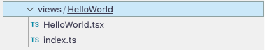
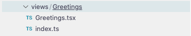

# Hoofdstuk 2: Greetings pagina

Na [stap 1](./step-1-redactie-module-setup.md) kunnen we effectief starten aan het ontwikkelen van onze module.\
We voorzien binnen dit hoofdstuk een "greetings" pagina dat de gebruiker begroet.\
Deze pagina maken we beschikbaar door een een menu item toe te voegen aan het algemene menu van de Redactie app.

## Stap 1: Greetings view aanmaken

De boilerplate code bevat reeds een voorbeeld view `HelloWorld`.\
Deze view mag verwijderd worden aangezien we deze niet meer zullen gebruiken.



Daarna maken we een eigen nieuwe module aan `Greetings`. Dit doen we door onder de `views` folder de volgende files aan te maken:



In de `views/Greetings/Greetings.tsx` file maken we de React component die we willen renderen als de Greetings pagina opgeroepen wordt.
```tsx
// public/lib/views/Greetings/Greetings.tsx
import React, { FC } from 'react';

const Greetings: FC = () => {
    return <h1>Hartelijk welkom!</h1>;
};

export default Greetings;
```

Momenteel bevat deze, zoals je ziet, enkel nog maar een titel maar dit zullen we later nog uitbreiden.
## Stap 2: Greetings pagina koppelen aan het menu

We hebben nu een Greetings view gemaakt maar deze zal voorlopig nog niets doen tot we aan de Core aangeven wanneer deze gerenderd moet worden.
Om de Greetings module te kunnen renderen binnen onze tenant, moeten we deze eerst koppelen aan een route.

Voor we deze view koppelen aan een route moeten we de net aangemaakte view component eerst nog beschikbaar stellen via de index.ts file (niet verplicht maar aangeraden):
```ts
// public/lib/views/Greetings/index.ts
export { default as Greetings } from './Greetings';
```

Daarna kunnen we deze Greetings view component gebruiken om deze te koppelen aan een route.\
De boilerplate heeft hiervoor al een `routes.ts` file voorzien. 
We kunnen deze aanpassen zodat deze onze Greetings view registreert bij de router.

```ts
// public/lib/routes.tsx
import { Greetings } from './views/Greetings';
...
    .subscribe(() => {
        Core.routes.register({
            path: '/greetings',
            component: Greetings,
        });
    });
```

Nu hebben aan de Core applicatie laten weten dat we onze Greetings view willen renderen wanneer ons url pad overeen komt met `[url]/client/[tenantId]/greetings`.
We kunnen dit testen door naar onze tenant te gaan en achter de tenantId in het pad `/greetings` te plaatsen (bv. [http://localhost:3102/client/d7eec02f-2f8d-4e0c-8505-f3ba65dab46b/greetings](http://localhost:3102/client/d7eec02f-2f8d-4e0c-8505-f3ba65dab46b/greetings))


We hebben nu succesvol een eigen view gekoppeld aan een route!\

De volgende stap is om deze route te koppelen aan een menu item.\
Dit kunnen we realiseren door onze route registratie uit te breiden met navigatie informatie als volgt:

```ts
// public/lib/routes.tsx
Core.routes.register({
    path: '/greetings',
    component: Greetings,
    navigation: {
        label: 'Begroeting',
    },
});
```

Van zodra we een `navigation` property meegeven aan onze route registratie met een `label`, weet de core dat we voor deze route ook een menu item willen voorzien.\
Als we nu onze pagina refreshen ziet deze er zo uit:


Een begroeting moet uiteraard eerst komen. Daarvoor moeten we aan de Core laten weten dat we het "Begroeting" menu item als eerste willen laten renderen in het menu.\
Dit doen we door een gewicht aan onze navigatie te koppelen.

```ts
// public/lib/routes.tsx
Core.routes.register({
    path: '/greetings',
    component: Greetings,
    navigation: {
        label: 'Begroeting',
        weight: -1
    },
});
```

Nu wordt ons begroeting menu item getoond waar het hoort. In het begin!


## Stap 3: Vertalingen

<!-- TODO: plaatst link naar best practices -->
We hebben nu onze Greetings pagina voorzien van een titel met een vaste tekst. Dit is nog niet volgens onze [best practices]().

De boilerplate voorziet reeds de nodige logica om te werken met vertalingen.\
Het enige wat we nog moeten doen is de vertalingen toevoegen en deze gebruiken in onze Greetings view.

```ts
// public/lib/i18next/translations.const.ts
const MODULE_TRANSLATIONS = Object.freeze({
    'GREETINGS_MENU-LABEL': tKey('GREETINGS_MENU', 'Begroeting (translated)'),
    GREETINGS_TITLE: tKey('GREETINGS_TITLE', 'Hartelijk welkom! (translated)'),
} as const);
```

Nu kunnen we de vertalingen toepassen op de label van ons 'Begroeting' menu item.

```ts
// public/lib/routes.tsx
import { MODULE_TRANSLATIONS } from './i18next/translations.const';
import { Greetings } from './views/Greetings';
...
    .subscribe(() => {
        Core.routes.register({
            path: '/greetings',
            component: Greetings,
            navigation: {
                label: translationsConnector.moduleTranslate(
                    MODULE_TRANSLATIONS['GREETINGS_MENU-LABEL']
                ),
                order: -1,
            },
        });
    });
```

We kunnen nu ook de titel in onze Greetings vanuit onze translations laten komen:
```tsx
// public/lib/views/Greetings/Greetings.tsx
import React, { FC } from 'react';

import translationsConnector from '../../connectors/translations';
import { MODULE_TRANSLATIONS } from '../../i18next/translations.const';

const Greetings: FC = () => {
    const [t] = translationsConnector.useModuleTranslation();
    return <h1>{t(MODULE_TRANSLATIONS.GREETINGS_TITLE)}</h1>;
};

export default Greetings;
```

Als laatste stap moeten we onze translations file opnieuw genereren.\
Dit kunnen we doen door het volgende commando uit te voeren:
```bash
npm run trans:extract
```
**Of** door de build opnieuw te starten
```bash
npm run build:w
```

Als we nu de pagina refreshen krijgen we het volgende te zien:


## Stap 4: Editorial UI gebruiken

Onze Greetings pagina ziet er nog niet echt uit zoals ander pagina's binnen de Redactie.\
Dit komt omdat we nog geen gebruik maken van de uitgebreide set aan UI componenten dat de Editorial UI en Antwerp UI voorzien.

Al eerste beginnen we met onze Greetings pagina van een `ContextHeader` te voorzien.
```tsx
// public/lib/views/Greetings/Greetings.tsx
import { Container, ContextHeader } from '@acpaas-ui/react-editorial-components';
...

const Greetings: FC = () => {
    const [t] = translationsConnector.useModuleTranslation();

    return (
        <>
            <ContextHeader title={t(MODULE_TRANSLATIONS.GREETINGS_TITLE)} />
            <Container>TODO</Container>
        </>
    );
};
```


Dat ziet er al beter uit maar nog niet helemaal zoals op andere pagina's. We ontbreken nog breadcrumbs.
de breadcrumbs kunnen we bereken op basis van de `useBreadcrumbs` hook.
```ts
// public/lib/views/Greetings/Greetings.tsx
import { ModuleRouteConfig, useBreadcrumbs } from '@redactie/redactie-core';
import { useNavigate, useRoutes } from '@redactie/utils';
...
const Greetings: FC = () => {
    ...
    const { generatePath } = useNavigate();
    const routes = useRoutes();
    const breadcrumbs = useBreadcrumbs(routes as ModuleRouteConfig[], {
        excludePaths: ['/', `${TENANT_ROOT}`, `${TENANT_ROOT}/greetings`],
        extraBreadcrumbs: [
            {
                name: 'Home',
                target: generatePath('/'),
            },
        ],
    });
    ...
};
```
We gebruiken hiervoor een aantal hooks, beschikbaar gesteld door de Core en utils package.

- useNavigate => voorziet een methode om links op te bouwen binnen de Redactie context
- useRoutes => haalt alle routes op, geregistreerd op de core
- useBreadcrumbs => Berekent op basis van alle routes de huidige breadcrumbs en geeft een renderbaar breadcrumb component terug.\
Via `excludePaths` kunnen we bepaalde route segmenten negeren en via `extraBreadcrumbs` kunnen we zelf route segmenten toevoegen.

Wat ons nu nog rest is de breadcrumbs effectief renderen. Dit kunnen we doen door in deze `ContextHeader` een `ContextHeaderTopSection` te plaatsen:
```ts
// public/lib/views/Greetings/Greetings.tsx
...
const Greetings = (): ReactElement => {
    ...

    return (
        <>
            <ContextHeader title={t(MODULE_TRANSLATIONS.GREETINGS_TITLE)}>
                <ContextHeaderTopSection>{breadcrumbs}</ContextHeaderTopSection>
            </ContextHeader>
            <Container>TODO</Container>
        </>
    );
};
```

Als we pagina refreshen krijgen we dan het volgende resultaat:


Dit lijkt al veel meer op een pagina zoals we deze gewoonlijk kennen in de Redactie.
We beschikken nu over alle basisconcepten om een eigen pagina te renderen binnen de Redactie.

In het volgende hoofdstuk gaan we kijken hoe we een backend module opzetten zodat we deze later binnen onze nieuwe Greetings pagina kunnen aanspreken.

## FAQ

+ Mijn wijzigingen komen niet door +

  Indien alle stappen correct verlopen zijn en je nog steeds geen wijzigingen ziet, kan je de volgende zaken proberen:
  - Zorg ervoor dat je de pagina inlaadt zonder cache (Tip: zet je console open en selecteer daar `Disable cache` in de network tab).
  - Valideer of het lokale pad (deel voor `:`) in de `docker-compose.yml` het juiste relatief pad bevat naar je lokale module folder.
  - Ga na of de module juist geconfigureerd is in de WCM Admin en of deze correct gekoppeld is aan de tenant.

+ De vertalingen zijn niet aangepast naar wat je ingevuld hebt in het `translations.const.ts` bestand +

  Herstart de build van de module door het volgende commando te runnen en refresh dan de pagina.
  ```bash
    npm run build:w
  ```
  Zie ook "Mijn wijzigingen komen niet door" hierboven