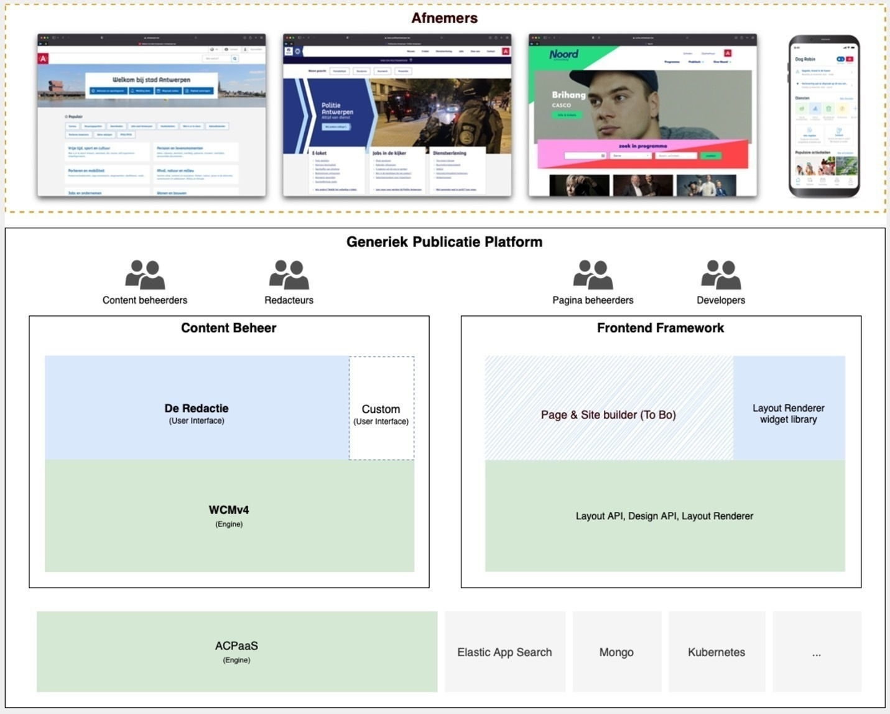

# GPubP
Het **G**eneriek **Pub**licatie **P**latform

## Voor wie is het GPubP ?

Het **G**eneriek **Pub**licatie **P**latform is een verzameling van *bouwstenen* en tools ter *ondersteuning* voor de bouw en uitbating van web platformen waaronder www.antwerpen.be, www.politieantwerpen.be, etc.

* De bouwstenen zijn er voor **afnemers** die websites willen *maken*. 
* De tools voor hoofdzakelijk **redacteurs** die de websites willen *beheren*.

## GPubP Content en Frontend

Het GPubP bestaat conceptueel uit 2 delen, deze kan je appart of samen gebruiken:

* In het **Content** luik vind je de [Redactie UI](https://redactie.antwerpen.be) alsook de [WCMv4](https://acpaas.digipolis.be/nl/product/web-content-management-engine/web-content-management-engine-forms-module) terug. 
* In het **Frontend** luik zal je de [Layout Renderer](https://layout-renderer-a.antwerpen.be/)  en de Page & Site builder terugvinden (ETA 2023).

> [!NOTE|label:Wist je dat]
> Het GPubP is een evolutie van de ACPaaS Web Content Management Engine (WCM) v3, een ACPaaS engine waar reeds veel websites (30+) mee gemaakt zijn voor de groep Antwerpen.
